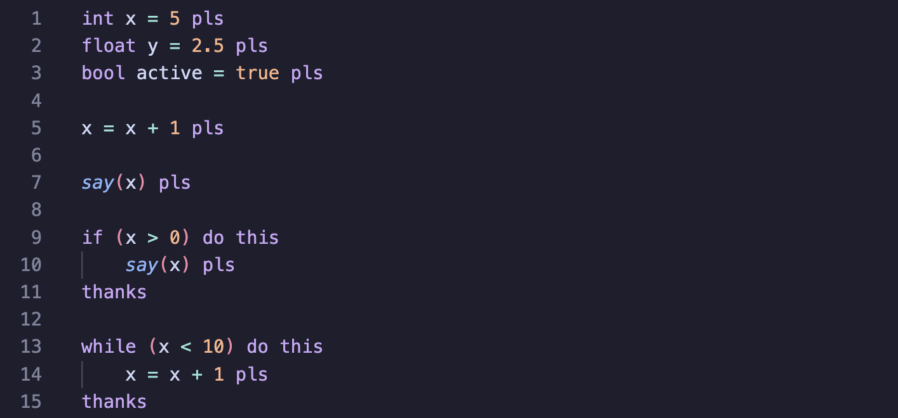

# polite-lang README

Welcome to the official Visual Studio Code extension for **poLite**! 

poLite is a custom, minimal, and "polite" C-like programming language built using Flex and Bison. This extension provides syntax highlighting to make reading and writing `.plt` files a colorful and pleasant experience.

## Features

This extension provides full syntax highlighting for the poLite language. Specifically, it recognizes and highlights:

* **Polite Syntax:** `pls` (replaces `;`), `do this` (replaces `{`), `thanks` (replaces `}`)
* **Control Flow:** `if`, `otherwise` (replaces `else`), `while`
* **Data Types:** `int`, `float`, `bool`, `char`, `string`
* **Built-in Functions:** `say()` (replaces `print()`)
* **Literals:** Booleans (`true`, `false`) and numbers
* **Comments:** C-style block comments (`/* ... */`)

## Requirements

There are no specific requirements to use this syntax highlighting extension. 

However, to actually compile and run poLite code, you will need your custom poLite compiler (built with Flex and Bison) installed on your system.

## Extension Settings

This extension currently does not add any custom VS Code settings. It works entirely out of the box: simply open any `.plt` file and the polite syntax highlighting will be applied automatically.

## Known Issues

No known issues at this time. 

*(Note: As the poLite language expands in future releases—such as adding full relational and logical expressions—this extension will be updated accordingly).*

## Release Notes

### 1.0.0

* Initial release of the polite-lang extension.
* Added basic syntax highlighting for `.plt` files.
* Support for polite keywords, data types, numbers, booleans, and block comments.